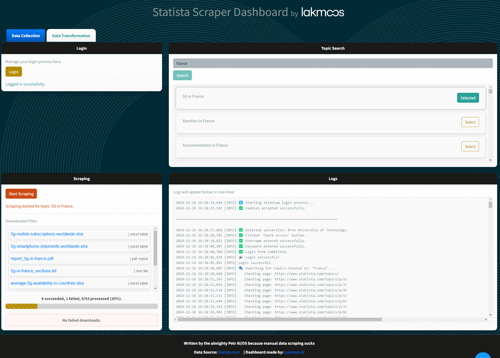
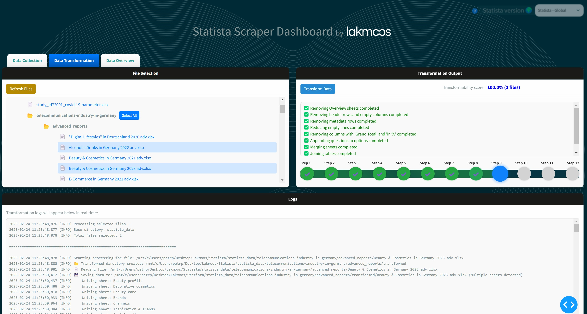

# Statista Scraper Project

## Table of Contents
1. [Introduction](#introduction)
2. [Features](#features)
3. [Setup and Installation](#setup-and-installation)
4. [Usage](#usage)
   - [Command-line Scraper](#command-line-scraper)
   - [Dashboard GUI](#dashboard-gui)
5. [Transformation Pipeline](#transformation-pipeline)
6. [Output Format](#output-format)
7. [Preview](#preview)
8. [Configuration](#configuration)
9. [Dependencies](#dependencies)
10. [Examples](#examples)
11. [Troubleshooting](#troubleshooting)
12. [Contributors](#contributors)
13. [License](#license)

---

## Introduction

The **Statista Scraper** is a Python-based project for automating the collection, transformation, and organization of data from Statista. It includes:
- A command-line script (`scraper.py`) for data scraping.
- A user-friendly web-based GUI built with Dash (`gui.py`).

The scraper allows users to log in, search for topics, and download associated data in formats like `.xlsx`, `.csv`, and `.pdf`. The output consists of a huge distribution table, and `scripts/get_topic_overview.py` can be used to automatically generate a template for SQLAlchemy.

---

## Features

- **Automated Login**: Secure login using Selenium with session cookie handling.
- **Topic Search**: Search and select specific topics from Statista.
- **Data Scraping**: Download reports, statistics, and raw data files in various formats.
- **Dashboard Interface**: Intuitive GUI for managing login, topic selection, and progress tracking.
- **Robust Transformation Pipeline**: A multi-step pipeline that processes, cleans, and transforms data from Statista, ensuring high data quality.
- **Logging**: Comprehensive logging for troubleshooting and debugging.

---

## Setup and Installation

1. **Clone the repository**:
    ```bash
    git clone https://github.com/your-repo/statista-scraper.git
    cd statista-scraper
    ```

2. **Install dependencies using Poetry**:
    ```bash
    poetry install
    ```

3. **Activate the virtual environment**:
    ```bash
    poetry shell
    ```

4. **Set up environment variables**:
    - Create a `.env` file in the root directory:
        ```env
        STATISTA_USERNAME=your_username
        STATISTA_PASSWORD=your_password
        OPENAI_API_KEY=key
        ```

5. **Install ChromeDriver**:
    The script uses `chromedriver_autoinstaller` to automatically install the required ChromeDriver version.

---

## Usage

### Command-line Scraper

To run the scraper script:
```bash
poetry run python scraper.py
```

### Dashboard GUI

To launch the GUI:
```bash
poetry run python gui.py
```

Access the web app at `http://127.0.0.1:8050` in your browser.

---

## Transformation Pipeline

The transformation pipeline is a robust multi-step process that ensures high data quality and consistency when processing files available on Statista. It includes:

1. **Remove Overview Sheets**: Eliminates unnecessary overview sheets.
2. **Remove Header Rows and Empty Columns**: Cleans up the structure for better data processing.
3. **Remove Metadata Rows**: Filters out unwanted metadata and irrelevant rows.
4. **Reduce Empty Lines**: Ensures cleaner tables by removing excessive empty lines.
5. **Remove Total Percentages and Demographics**: Cleans out redundant total percentage columns.
6. **Append Questions to Options**: Enhances dataset clarity by appending relevant questions to response options.
7. **Merge Sheets**: Combines multiple sheets into a single structured table.
8. **Join Tables**: Ensures consistency and deduplicates important demographic data.
9. **Transpose Tables**: Reformats the structure for optimal data alignment.
10. **Map Age Categories**: Converts generational categories into specific age ranges.
11. **Filter Advanced Files**: Selectively processes advanced files based on predefined criteria.
12. **Transform Data to Probability Format**: Converts numerical data into probability distributions, enhancing statistical usability.

This pipeline is designed to handle a variety of data structures found in Statista files, making it highly adaptable to different datasets.

---

## Output Format

The final output file is formatted to be compatible with the AI backend. The result is a **distribution table** where:
- **Demographic attributes** such as `gender` and `age` serve as input features.
- **Topic-related attributes** represent output values that the AI model aims to predict, with probability values between `0.0` and `1.0`.

Example format:

| gender | age  | Question 1 (Base) | Question 1 (Option A) | Question 1 (Option B) | Question 2 (Base) | ... |
|--------|------|-------------------|-----------------------|-----------------------|-------------------|-----|
| female | 31-45 | 1.00 | 0.18 | 0.49 | 0.14 | ... |
| male   | 31-45 | 1.00 | 0.22 | 0.41 | 0.19 | ... |
| female | 46-60 | 1.00 | 0.15 | 0.39 | 0.20 | ... |
| male   | 46-60 | 1.00 | 0.14 | 0.48 | 0.17 | ... |

Each probability value represents a proportion relative to the base column, making it suitable for machine learning models that require structured input-output relationships.

---

## Database Schema Generation

To speed up the database schema definition process, the script `scripts/get_topic_overview.py` automatically parses the output table and generates a structured template. This template can be used directly in database schema definitions, making integration seamless.

Example output:

```python
from typing import Optional, Literal
from pydantic import BaseModel, Field

class DigitalLifestyle(BaseModel):
    """DigitalLifestyle Model with structured formatting."""
    which_statement_about_digital_engagement_do_you_agree_with: Optional[
        Literal[
            "i_actively_seek_to_improve_my_digital/computing_skills",
            "i_enjoy_having_so_much_information_at_my_fingertips",
            "nowadays_it_is_important_to_understand_the_digital_world_if_you_want_a_career",
            "i_feel_forced_to_be_online",
            "my_digital_skills_give_me_a_greater_sense_of_freedom",
            "digital_skills_are_essential_for_everyday_life",
            "the_covid-19_pandemic_and_lockdown_have_pushed_me_to_improve_my_digital_skills",
            "none_of_the_above"
        ]
    ] = Field(default=None, description="Thinking_about_how_you_engage_with_the_digital_world_generally_which_of_the_following_statements_do_you_agree_with")
```

This ensures that the parsed data maintains a structured and standardized format that aligns with AI model training and database storage requirements.

---

## Preview

Below is a preview of the Statista Scraper dashboard interface:

### Scraping Tab


### Transformation Tab


---

## Configuration

Modify the following settings in `scraper.py` as needed:
- `LOGIN_URL`: The login URL for Statista.
- `TOPICS_URL`: The base URL for topics.
- `DEST_FOLDER`: Directory for saving downloaded files.

---

## Dependencies

- Python 3.7+
- Managed using Poetry. All dependencies are listed in `pyproject.toml`.

---

## Examples

### Searching for a Topic
1. Enter the desired topic (e.g., "France") in the GUI.
2. Select the desired topic from the search results.
3. Start the scraping process.

### Downloaded Files
Scraped files are saved in the `statista_data` directory, organized by topic.

---

## Troubleshooting

- **Login Errors**: Ensure correct username and password in the `.env` file.
- **Browser Issues**: Verify that Google Chrome is installed and up-to-date.
- **Failed Downloads**: Check `scraper.log` for error details.

---

## Contributors

- **Petr AI/DS**: Developer, design, implementation.

---

## License

This project is licensed under the MIT License. See the `LICENSE` file for details.
